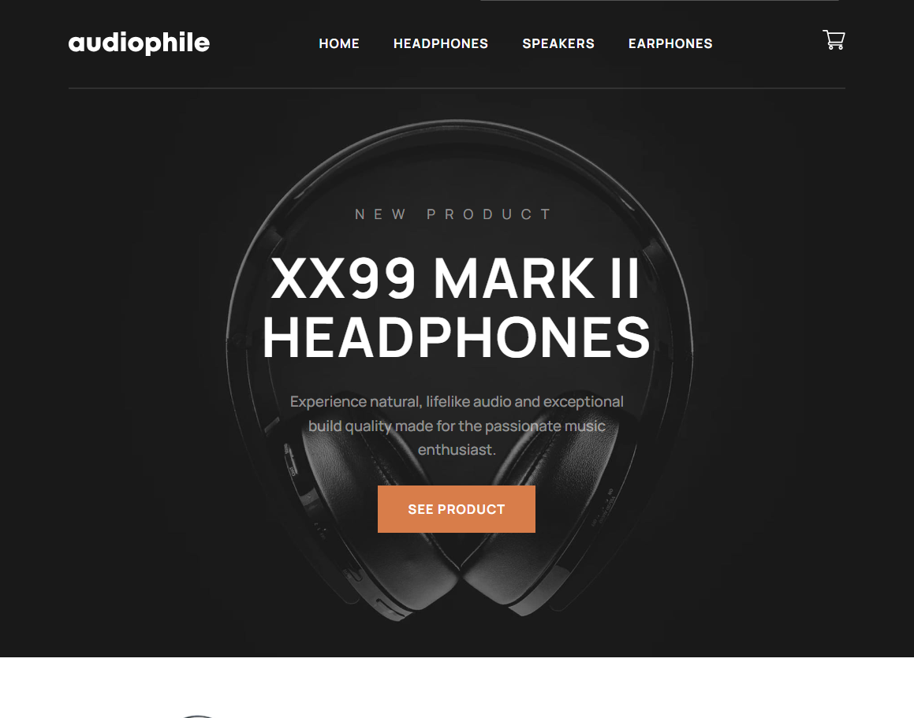

# Audiophile

This is a solution to the [Audiophile e-commerce website challenge on Frontend Mentor](https://www.frontendmentor.io/challenges/audiophile-ecommerce-website-C8cuSd_wx).

The challenge involved building a multi-page ecommerce website for audio products with a welcome page, category page, product page and checkout page.

## Table of contexts

- [Overview](#overview)
  - [The challenge](#the-challenge)
  - [Screenshot](#screenshot)
  - [Links](#links)
- [My process](#my-process)
  - [Stack](#stack)
  - [What I learned](#what-i-learned)
  - [Continued development](#continued-development)
- [Author](#author)

## Overview

### The challenge

Users should be able to:

- [x] View the optimal layout for the app depending on their device's screen size
- [x] See hover states for all interactive elements on the page
- [x] Add/Remove products from the cart
- [x] Edit product quantities in the cart
- [x] Fill in all fields in the checkout
- [x] Receive form validations if fields are missed or incorrect during checkout
- [x] See correct checkout totals depending on the products in the cart
  - Shipping always adds $50 to the order
  - VAT is calculated as 20% of the product total, excluding shipping
- [ ] See an order confirmation modal after checking out with an order summary
- [x] Keep track of what's in the cart, even after refreshing the browser.

### Screenshot

### Links

- [Live Site](https://audiophile-commerce.vercel.app/)

## My process

### Stack

### What I learned

#### Atomic Design

I learned this design methodology from a Medium article. It basically involves separating the user interface into five fundamental building blocks, each with a different level of importance: atoms, molecules, organisms and templates. This fits very well with the compositional nature of React and improves the scalability and readability of the project.

In this way, it is not necessary to repeat paragraphs, buttons, headings and re-specify their classes between different components. You combine classes and elements to create atoms, atoms to create molecules... Each building block builds on the previous building block.

#### Next.js

The star development framework for React projects. It offers various rendering methods for pages, apart from other tools to optimize resources such as images and fonts, an ingenious routing system based on the structure of directories and files.

As an application without API rest server, with data predefined in a JSON, the pages are 100% prerendered and statically generated, reducing the need to compute the pages in the server.

### Continued development

I will possibly implement a functionality for card payment with Stripe developer mode.

## Author

[Linkedin](https://www.linkedin.com/in/alexander-gh/)
